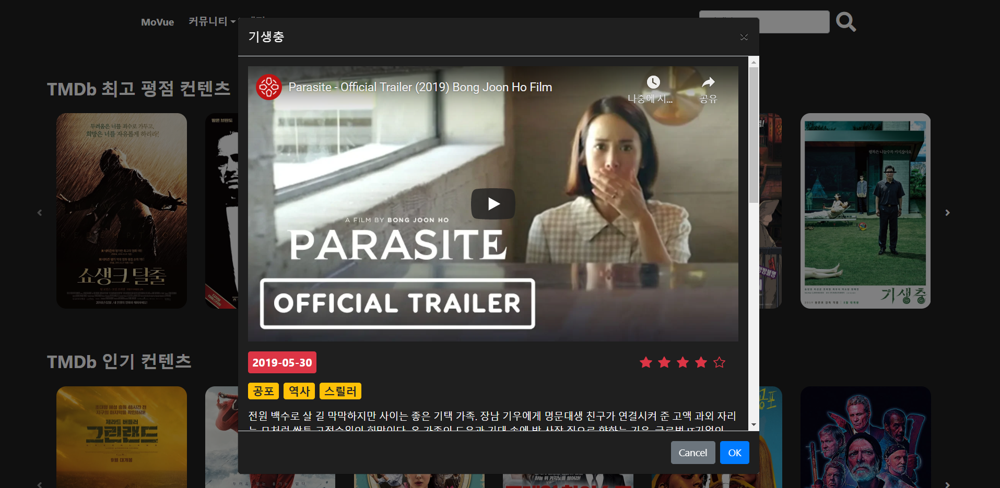

# 영화 추천 프로그램 MoVue

> **특징**
>
> ```사용자 중심``` 의 영화 추천 서비스 구현
>
> 확실한 유지보수로 ```높은 완성도``` 달성
>
>  ```Vue.js```와 ```Django```를 활용한 서비스 설계
>
> ```약 2만 개의 데이터``` 를 효율적으로 관리
>
> ```SPA```
>
> ```반응형``` 디자인  - 모바일 환경에서 사용가능

## 배포 서버 URL

Vue.js  ```http://movuejbcw.s3-website.ap-northeast-2.amazonaws.com/```

Django ```52.15.33.63```


## 사전 세팅

### 업무 분담 내역

- 장주빈 (팀장) - 풀스택
- 강채원 (팀원) - 일개미


### ERD

#### Django 구조

```
|   .gitignore
|   db.sqlite3
|   manage.py
|   output.txt
|   requirements.txt
|   
+---.idea
+---.vscode
|       settings.json
|       
+---accounts
|   |   admin.py
|   |   apps.py
|   |   models.py
|   |   serializers.py
|   |   tests.py
|   |   urls.py
|   |   views.py
|   |   __init__.py
|   |   
|   +---migrations
|           
+---community
|   |   admin.py
|   |   apps.py
|   |   models.py
|   |   serializers.py
|   |   tests.py
|   |   urls.py
|   |   views.py
|   |   __init__.py
|   |   
|   +---migrations
|           
+---movies
|   |   admin.py
|   |   apps.py
|   |   models.py
|   |   serializers.py
|   |   tests.py
|   |   urls.py
|   |   views.py
|   |   __init__.py
|   |   
|   +---fixtures
|   |       genres.json
|   |       movies_db99.json
|           
+---reviews
|   +---migrations
|           
+---server
|   |   asgi.py
|   |   settings.py
|   |   urls.py
|   |   wsgi.py
|   |   __init__.py
|           
\---venv
```

#### Vue.js

```
|   .gitignore
|   babel.config.js
|   out.txt
|   package-lock.json
|   package.json
|   README.md
|
+---public
|       favicon.ico
|       index.html
|
---src
    |   App.vue
    |   main.js
    |
    +---assets
    |   |   bg-7.jpg
    |   |
    |   +---LandingPage
    |   |
    |   ---movieimg
    |
    +---components
    |       CommentList.vue
    |       MovieModal.vue
    |       Movies.vue
    |       Navbar.vue
    |       ReviewForm.vue
    |       ReviewList.vue
    |       UpdateReview.vue
    |
    +---router
    |       index.js
    |
    +---store
    |       index.js
    |
    ---views
        |   Home.vue
        |   LandingPage.vue
        |
        +---accounts
        |       Login.vue
        |       Signup.vue
        |
        ---community
                ArticleDetail.vue
                Community.vue
                CreateArticle.vue
                UpdateArticle.vue
```

#### ERD 


--------------------------------

## 목표 서비스 구현, 실제 구현 기능 설명

### 0. 개발 도구


### 1. 메인 페이지

> 심플한 디자인의 메인 페이지

- MoVue 사이트를 처음 접속했을 때 아래와 같은 화면이 나타납니다. 


- 인증되지 않은 사용자가 상위 메뉴들을 클릭했을 때 **경고창**을 띄워 로그인을 유도했습니다. 


### 2. 영화 추천 시스템

#### 리뷰기반 추천 알고리즘

> ```사용자들의 취향```을 고려한 추천 시스템!

- 각 사용자들이 남긴 리뷰를 기반으로, 많이 작성한 장르의 영화들을 추천해주는 시스템입니다.
  이미 본 영화는 추천 컨텐츠 목록에서 제외하여 사용자의 만족도를 높였습니다.


ex)  장르에 리뷰를 많이 남긴 사용자의 **리뷰기반 추천 컨텐츠** 목록


####  TMDb 최고 평점 컨텐츠, TMDb 인기 컨텐츠, 개봉 예정 컨텐츠, 현재 상영 중 컨텐츠

> "뭘 좋아할지 몰라서 다 가져왔어"

- 다양한 TMDb API를 활용하여 영화 선택을 고민하는 사용자들에게 선택의 폭을 넓혀주었습니다.


### 3. 영화 정보

> 각 영화를 클릭하면 나타나는 영화 정보 페이지

- Youtube API를 사용해 클릭한 영화의 예고편을 볼 수 있게 구현했습니다.
- 영화의 개봉일, 장르, 줄거리, TMDb 평점을 나타냈습니다.


- ```"이런 영화 어때요?"```

  - 선택한 영화와 비슷한 장르의 영화 목록이 나타나도록 구현했습니다. 비슷한 영화를 클릭했을 때 그 영화정보 페이지로 이동할 수 있습니다. 

  

- ```한줄평 남기기```

  - 로그인한 모든 사용자는 클릭한 영화에 대한 한줄평과 평점을 남길 수 있습니다. 
  - 모든 한줄평은 작성한 사용자만 수정&삭제할 수 있습니다.


### 4. 계정

- ```랜덤 배경 이미지```
  - lodash를 활용하여 랜덤 인덱스를 선정하여 해당 인덱스의 이미지를 배경으로 지정하였습니다. 회원가입, 로그인 페이지에 접속할 때마다 다른 배경 이미지를 볼 수 있습니다.


#### 회원가입, 로그인


- 아이디가 이미 존재하는 경우와 비밀번호가 틀릴 경우, 각각 다른 에러 메세지를 나타내어 ```사용자가 어느 부분을 수정해야할지``` 알려주었습니다.

  

  

- ```from rest_framework_jwt.views import obtain_jwt_token``` 로 불러온 ```api-token-auth```를 사용하여 토큰을 발급받아 로그인할 수 있도록 구현했습니다.


#### 관리자 페이지


- 관리자 권한의 유저만 영화를 등록 & 수정 & 삭제 권한, 유저 관리 권한을 가지도록 설계했습니다.


### 5. 커뮤니티

> 다양한 종류의 게시판! 

#### 자유게시판, 영화 추천 게시판, Q&A 게시판

- 사용자들은 ```다양한 종류의 게시판``` 을 통해 자유로운 대화를 할 수 있습니다.


#### 글 작성


#### 게시판 목록


#### 게시글

- 게시글을 작성한 사용자만 게시글을 수정& 삭제 할 수 있습니다. 
- 게시글 번호, 제목, 글쓴이, 내용, 생성시각, 수정시각을 나타내었습니다. 
- 각 게시글에는 댓글을 달 수 있습니다. 


### 6. 검색 기능

> 검색도 편리하게!

#### ```자동완성 기능```

- **vue-bootstrap-typeahead** 를 활용하여 자동완성 기능을 추가했습니다. 후보로 나타나는 영화 제목들을 클릭하여 검색 버튼을 누르면, 해당하는 영화의  title로 axios요청을 보내어 영화 정보 창을 화면에 띄웠습니다.


ex) 자동완성으로 **기생충**을 선택하여 검색했을 경우





### 7. 반응형 디자인

- 사용자의 화면 크기에 따라 프레임에 맞춰 웹 페이지의 크기가 재조정됩니다.

- ```반응형``` 디자인으로 구현하여 웹 뿐만 아니라 모바일 환경에서도 자유자재로 사용가능합니다. 


## 느낀점

- 강채원 : 일주일이라는 시간 안에 완성도 높은 웹 사이트를 만들고 싶었으나, 뜻대로 되지 않아 아쉬웠습니다. 특히 원했던 기능을 다 구현하지 못한 점이 가장 아쉬웠지만, 팀장님께서 잘 이끌어주시고 제 부족한 점을 완벽하게 메꿔주셔서 잘 마무리할 수 있었습니다. 
- 장주빈 : 한 학기동안 배운 내용을 활용해 볼 수 있어서 좋은 시간이었습니다. 자바스크립트와 Vue.js가 익숙하지 않아서, Django 와 Python 에 비해 너무 많은 노력이 필요했고, 코드를 통해 생각한 내용을 구현하다 보면 예상치 못한 오류가 자주 발생해서 아쉬웠습니다. 하지만 하나하나 오류를 해결해가는 과정에서 단순히 강의를 듣기만 할 때보다 더 많은 것을 배울 수 있었습니다. 다음에 또 온전히 프로젝트에 시간을 쏟을 수 있는 기회가 생긴다면 Vue.js 로 다시 한 번 오류없고 깔끔한 로직을 갖고 있는 프로젝트에 도전해보고 싶습니다.